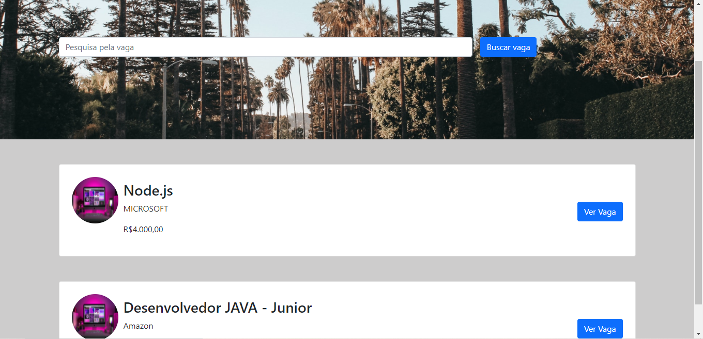
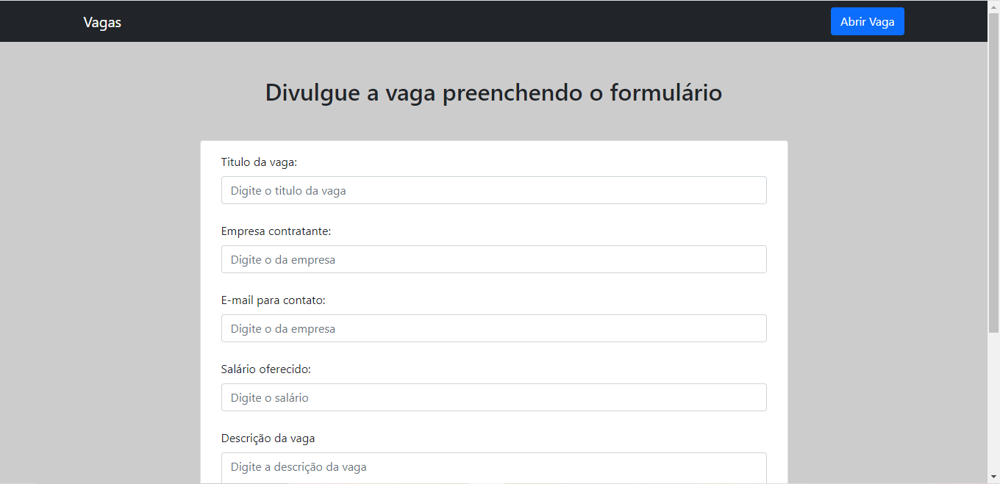
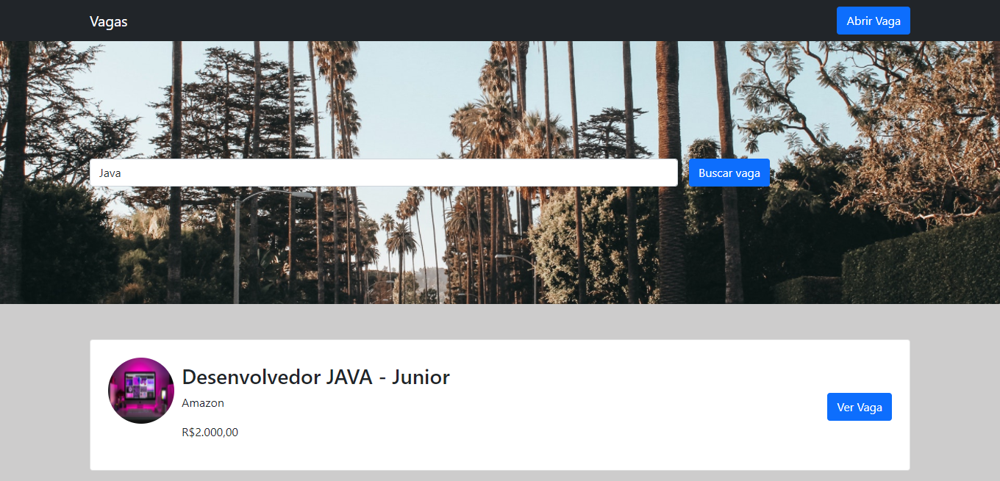
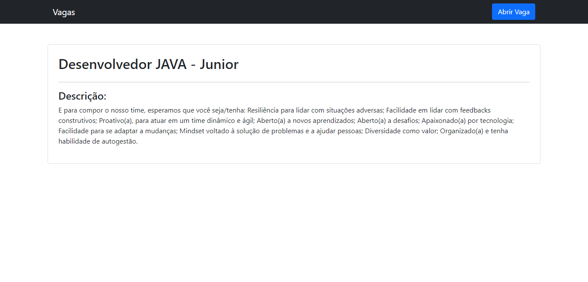

# Vagas

Um site de vagas de emprego

## Sobre o Projeto

Este projeto consiste em filtrar, cadastra novas vagas e mostrar descrição de cada vaga.

## Demonstração do projeto

Foto do projeto

## Objetivo do projeto

Projeto desenvolvido para treinar Node.js

## Tecnologias Usadas no projeto

Projeto feito utilizando as seguintes linguagens/tecnologias: 

* Node.js
* Express
* Sequelize
* Mysql
